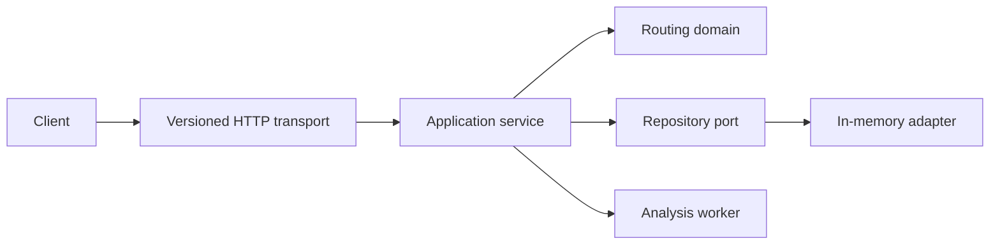

# Route Analysis Service

Route Analysis Service is a pure Go, versioned HTTP API for directed, time-dependent road-network analysis. It deliberately contains no map UI or delivery/order workflow. The server imports a dataset graph, applies time-windowed incidents, computes routes, candidate routes and isochrones, and executes asynchronous OD matrix or centrality jobs.

## Run

```sh
go run ./cmd/route-service
curl http://localhost:8084/healthz
```

The in-memory `demo-city` network is seeded on startup. Submit a route:

```sh
curl -X POST http://localhost:8084/api/v1/route \
  -H 'Content-Type: application/json' \
  -d '{"datasetId":"demo-city","from":"A","to":"D","mode":"drive","departure":"2026-08-19T10:00:00Z"}'
```

## Architecture



The domain package owns topology, edge eligibility and incident cost semantics. Transport only validates JSON and turns domain errors into API errors. The in-memory adapter is intentionally replaceable through `domain/ports.Repository`; a PostgreSQL/PostGIS adapter can be added without changing algorithms.

## API

| Endpoint | Purpose |
| --- | --- |
| `GET /healthz`, `GET /readyz` | process liveness and readiness |
| `GET/POST /api/v1/datasets` | dataset catalog |
| `POST /api/v1/datasets/{id}/import` | atomically install nodes and edges |
| `POST /api/v1/route` | A* route with incident explanation |
| `POST /api/v1/k-routes` | bounded alternative routes |
| `POST /api/v1/isochrone` | reachable node set inside a time budget |
| `GET/POST /api/v1/incidents` | incident timeline records |
| `POST /api/v1/incidents/{id}/activate` | optimistic-lock activation with `If-Match` |
| `GET/POST /api/v1/jobs` | asynchronous OD, isochrone or centrality tasks |

## State Machines

Dataset: `draft -> importing -> ready -> archived`; this initial adapter directly creates ready demo data and atomically installs a graph.

Incident: `draft -> active -> resolved|revoked`. An active incident may close an edge or apply a multiplicative speed factor. Higher-priority incidents are evaluated first.

Job: `queued -> running -> succeeded|failed|cancelled`. The worker records checkpoint-like progress and completion timestamps; jobs are bounded to 30 seconds in the local adapter.

## Operations and Limits

- HTTP has 2 MiB JSON request cap, read/write deadlines, structured JSON logs and graceful SIGINT/SIGTERM shutdown.
- Route queries pin a graph snapshot before A* starts, so graph changes cannot mix versions during a request.
- Time-dependent edge cost incorporates access rules, vehicle restrictions, toll avoidance, grade limits and active incidents.
- This local profile retains data only in memory. It is designed for smoke testing and should be replaced by PostgreSQL/object storage before production use.

## Data Contract

The graph importer requires nodes with `id` and valid WGS84 `location`, and edges with `id`, `from`, `to`, positive `lengthMeters`, positive `baseSeconds`, and at least one supported `modes` value. All imported edges must refer to nodes in the same dataset.

## Validation

```sh
gofmt -w .
go vet ./...
go test ./...
go run ./cmd/route-service
```

## Security Notes

Run behind an identity-aware gateway in a production deployment. Dataset isolation, quota enforcement and persistence encryption are explicit extension points; the local demonstration avoids pretending these controls exist. Avoid logging raw imported source records if they contain sensitive mobility data.
